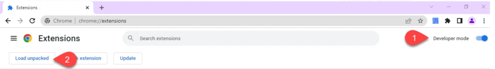

<a name="readme-top"></a>


<!-- PROJECT LOGO -->
<br />
<div align="center">
    

  <h3 align="center">Two Subs</h3>

  <p align="center">
    A chrome extension to insert two subtitles simultaneously to a video. Integrates with an Japanese/English Anime Subtitles search engine for convenient Japanese language learning. 
    <br />
    <a href="https://github.com/tariqmassaoudi/two-subs/issues">Report Bug</a>
    ·
    <a href="https://github.com/tariqmassaoudi/two-subs/issues">Request Feature</a>
  </p>

</div>
<div><p align="center">

</p>
    </div>


<!-- TABLE OF CONTENTS -->
<details>
  <summary>Table of Contents</summary>
  <ol>
    <li>
      <a href="#demo-video">Demo Video</a>
    </li>
      <li><a href="#general-use-case">General Use Case</a></li>
    <li>
      <a href="#japanese-learning-use-case-instructions">Japanese Learning Use Case Instructions</a>
    </li>
    <li><a href="#installation">Installation</a></li>
     <li><a href="#installation">Developement</a></li>
     <li><a href="#features">Features</a></li>
    <li><a href="#roadmap">Roadmap</a></li>
    <li><a href="#contributing">Contributing</a></li>
    <li><a href="#license">License</a></li>
    <li><a href="#contact">Contact</a></li>
    <li><a href="#acknowledgments">Acknowledgments</a></li>
  </ol>
</details>


## Demo Video

https://user-images.githubusercontent.com/52799665/226168304-1ec7cf8d-3343-4d5c-8579-40479af9c4ce.mp4
<!-- GETTING STARTED -->
## General Use Case

* Load subtitles in your native language and target language you want to learn to a video.
* You can find subtitles for most content on Open Subtitles or Yify Subtitles. 
* Look for an on hover dictionnary chrome extension that supports your target language.


## Japanese Learning Use Case Instructions

* Set up Yomichan, follow instructions here: https://learnjapanese.moe/yomichan/
* Find your favorite anime.
* Look up subtitles in the integrated anime subs search, if you can't find them look on the web.
* Load the subtitles and watch, whenever you encounter a word you can't understand, press "shift" and hover over it to see definition. 

### Installation


1. Clone or download the repo to your local machine.
2. Open chrome and go to chrome://extensions/ , enable developer mode and click Load unpacked.
 
4. From the repo you downloaded select the build folder.
 


<p align="right">(<a href="#readme-top">back to top</a>)</p>

### Developement

```
git clone https://github.com/tariqmassaoudi/two-subs
cd two-subs
npm install
npm start
```

<p align="right">(<a href="#readme-top">back to top</a>)</p>

<!-- USAGE EXAMPLES -->
## Features

* Add two subtitles simultaneously.
* Subtitles are selectable so can be used with external on hover dictionnary.
* Automatically pauses when you hover over substitles, automatically resumes when you exit hover.
* Integrated anime JP/ENG subtitles search
* Customize subtitle size, visibility, position and fix sync problems.


<p align="right">(<a href="#readme-top">back to top</a>)</p>


<!-- ROADMAP -->
## Roadmap

- [x] Release v1.0.0
- [ ] Look for and fix bugs
- [ ] Add more features


<p align="right">(<a href="#readme-top">back to top</a>)</p>


<!-- CONTRIBUTING -->
## Contributing

Contributions are what make the open source community such an amazing place to learn, inspire, and create. Any contributions you make are **greatly appreciated**.

If you have a suggestion that would make this better, please fork the repo and create a pull request. You can also simply open an issue with the tag "enhancement".
Don't forget to give the project a star! Thanks again!

1. Fork the Project
2. Create your Feature Branch (`git checkout -b feature/AmazingFeature`)
3. Commit your Changes (`git commit -m 'Add some AmazingFeature'`)
4. Push to the Branch (`git push origin feature/AmazingFeature`)
5. Open a Pull Request

<p align="right">(<a href="#readme-top">back to top</a>)</p>


<!-- LICENSE -->
## License

Distributed under the MIT License. See `LICENSE.txt` for more information.

<p align="right">(<a href="#readme-top">back to top</a>)</p>


<!-- CONTACT -->
## Contact

Tariq Massaoudi - [@linkedin](https://www.linkedin.com/in/tariqmassaoudi/) - tariq.massaoudi@gmail.com

Personal Website: [Tariq Massaoudi](https://tariqmassaoudi.com)

<p align="right">(<a href="#readme-top">back to top</a>)</p>


<!-- ACKNOWLEDGMENTS -->
## Acknowledgments

Use this space to list resources you find helpful and would like to give credit to. I've included a few of my favorites to kick things off!

* [Movie Subtitles](https://github.com/gignupg/Movie-Subtitles) for the base code.
* [Kitsunekko](https://kitsunekko.net/) for anime subtitles collection.


<p align="right">(<a href="#readme-top">back to top</a>)</p>


<!-- MARKDOWN LINKS & IMAGES -->
<!-- https://www.markdownguide.org/basic-syntax/#reference-style-links -->
[contributors-shield]: https://img.shields.io/github/contributors/othneildrew/Best-README-Template.svg?style=for-the-badge
[contributors-url]: https://github.com/tariqmassaoudi/two-subs/Best-README-Template/graphs/contributors
[forks-shield]: https://img.shields.io/github/forks/othneildrew/Best-README-Template.svg?style=for-the-badge
[forks-url]: https://github.com/tariqmassaoudi/two-subs/Best-README-Template/network/members
[stars-shield]: https://img.shields.io/packagist/stars/tariqmassaoudi/two-subs
[stars-url]: https://github.com/tariqmassaoudi/two-subs
[issues-shield]: https://img.shields.io/github/issues/othneildrew/Best-README-Template.svg?style=for-the-badge
[issues-url]: https://github.com/tariqmassaoudi/two-subs/Best-README-Template/issues
[license-shield]: https://img.shields.io/github/license/othneildrew/Best-README-Template.svg?style=for-the-badge
[license-url]: https://github.com/tariqmassaoudi/two-subs/Best-README-Template/blob/master/LICENSE.txt
[linkedin-shield]: https://img.shields.io/badge/-LinkedIn-black.svg?style=for-the-badge&logo=linkedin&colorB=555
[linkedin-url]: https://www.linkedin.com/in/tariqmassaoudi/
[product-screenshot]: images/screenshot.png

